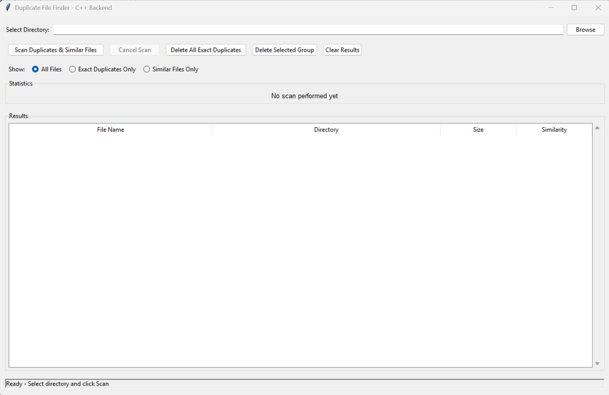
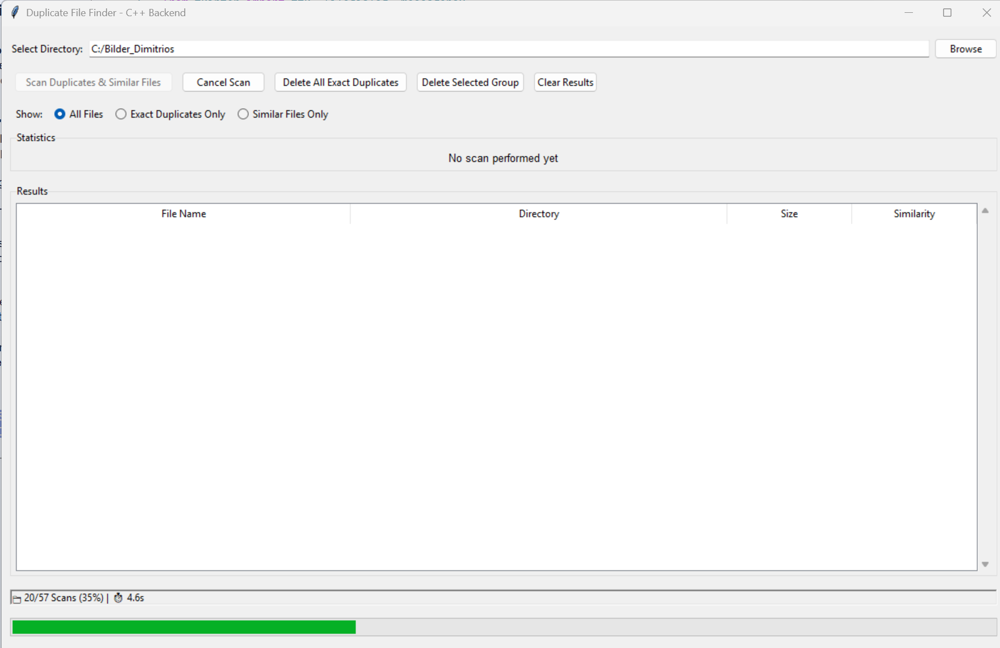
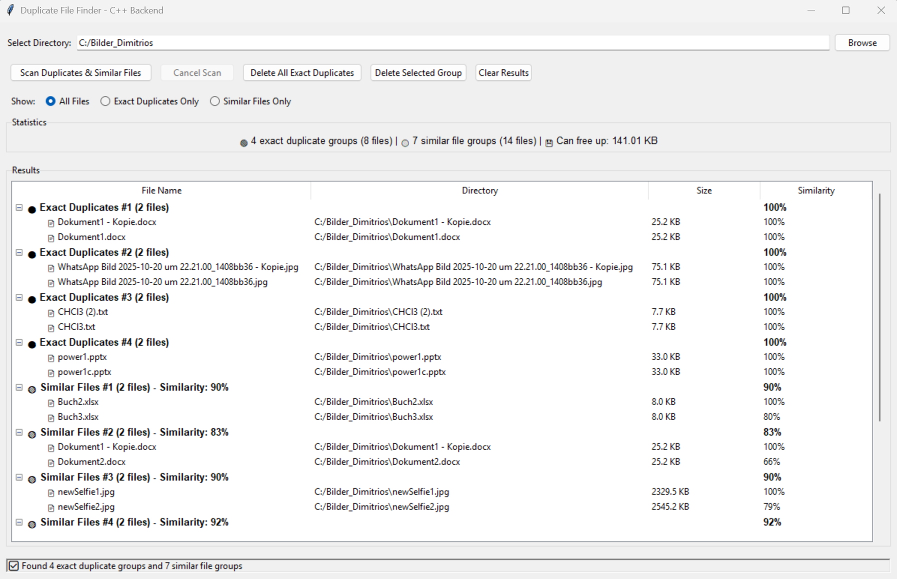
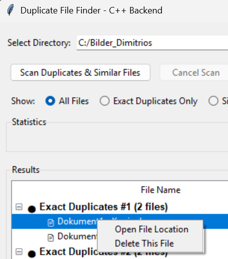
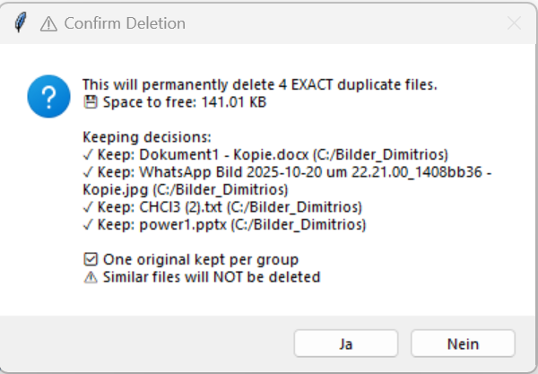
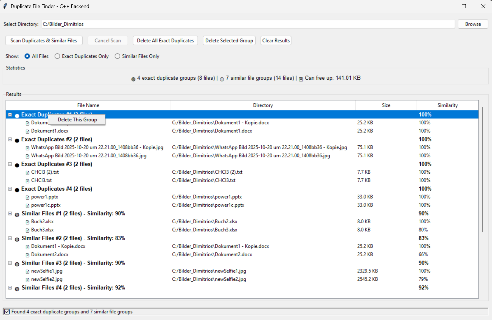
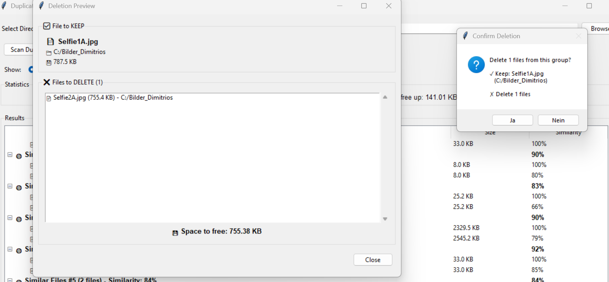

# MediaDuplicateFinder
**MediaDuplicateFinder** is a high-performance duplicate file finder that supports **any file type** — including images, audio, text, and Office documents.

It detects both **exact duplicates** (via file hashing) and **similar files** (via perceptual hashing and content analysis), even across different formats, sizes, and quality levels.

The core scanning engine is written in **C++** for maximum speed and efficiency.  
A **Python GUI** provides an intuitive interface for scanning, filtering, and safely deleting duplicates.  
For Office document comparison, a specialized Python script (`office_comparer_batch.py`) enables batch processing of Word, Excel, and PowerPoint files.

---

## 📦 Download
The latest precompiled version (including `duplicate_gui.py`, `office_comparer_batch.py`, and `duplicate_finder.exe`) can be downloaded from the [**Releases** section](../../releases/latest).  
Simply download the ZIP file, extract it, and run `duplicate_gui.py`.  
Make sure that all three files are located in the same directory.


---

## 🚀 Key Features
- **Ultra-fast duplicate detection** for large file collections
- Finds **similar images** using perceptual hashing (Average Hash + Difference Hash)
- **Audio similarity** detection via metadata and filename analysis
- **Office document comparison** (Word, Excel, PowerPoint) with deep content analysis
- **Text file comparison** using content-based similarity matching
- High-performance **C++ core** with integrated **stb_image** library
- Modern **Tkinter-based GUI** for easy file browsing and duplicate management
- **Batch processing** for efficient Office file comparisons   
---

## 🧩 Components Overview
| Component | Language | Purpose |
|------------|-----------|----------|
| `duplicate_finder.exe` | C++ | Core scanner for exact and similar files |
| `duplicate_gui.py` | Python | GUI frontend to visualize and manage results |
| `office_comparer_batch.py` | Python | Specialized Office file similarity comparison |

---

## ⚙️ Requirements
- **Python 3.8+**
- Required Python packages:
  ```bash
  pip install pillow numpy openpyxl python-docx python-pptx scikit-learn pydub
The following files **must be in the same directory**:

- `duplicate_finder.exe` – C++ backend
- `duplicate_gui.py` – GUI frontend
- `office_comparer_batch.py` – Office comparison script

---

## 🖥️ Usage
1. Run **`duplicate_gui.py`**

2. Click on **Browse** and select the folder you want to scan.
3. Click on **Scan Duplicates & Similar Files**. It will automatically scan all subfolders.

4. Finished Scan: You can see the results.

5. Delete files: You can now click on **Delete All Exact Duplicates**, or delete similar files manually, or delete similar groups.
<p align="center">
  
  
</p






---

## 🛠️ Build Instructions

If you want to build the C++ backend manually:
```bash
g++ -std=c++17 main_cli.cpp -o duplicate_finder
